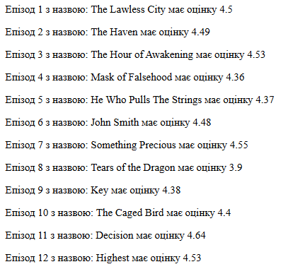
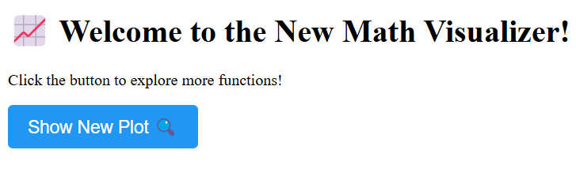
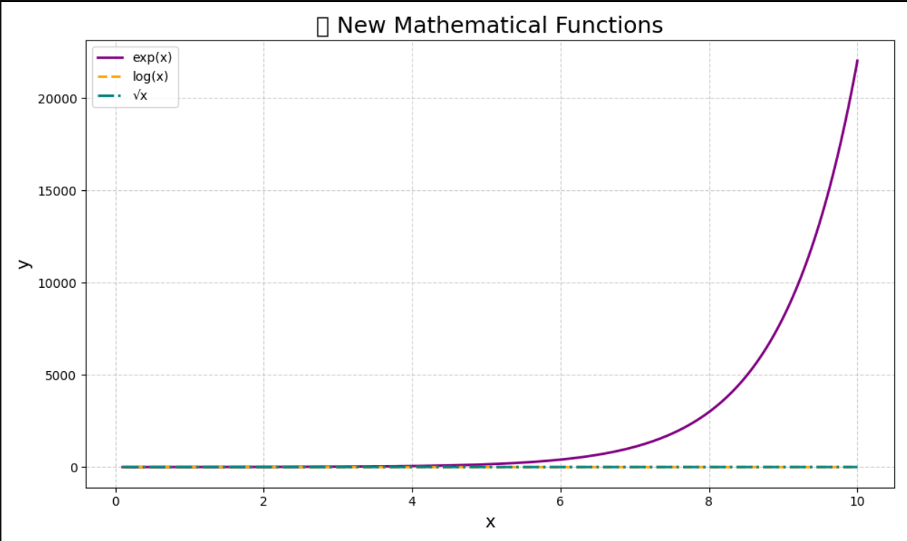

# Звіт до роботи 4

### Тема: _Віртуальні середовища_

### Мета роботи: _Ознайомитися з ізольованими середовищами у Python, встановленням та використанням сторонніх бібліотек, а також інструментами керування залежностями_
---------------------------------------------------------------
Ізольоване середовище — це окрема інсталяція Python із власними бібліотеками. Воно дозволяє створювати незалежні простори для кожного проєкту, уникаючи конфліктів між залежностями.


#### Перевірка PIP:

```
pip -V
pip --help
```
#### Команди pip:
* install – встановлення пакетів
* uninstall – видалення пакетів
* list – список встановлених пакетів
* freeze – список залежностей для requirements.txt
* show – інформація про пакет
* інші: check, download, config, cache, debug, search, wheel, inspect, completion, help
#### Встановлені бібліотеки:
* pip 24.3.1
* setuptools 75.8.0
* requests 2.32.3
* httpx 0.28.1
* numpy 2.2.2
* ipykernel 6.29.5
* ipython 8.31.0
* jupyter_client 8.6.3
* jupyter_core 5.7.2
* traitlets 5.14.3
* matplotlib-inline 0.1.7
* urllib3 2.3.0
* cachecontrol 0.14.2
* build 1.2.2.post1
* virtualenv 20.29.1
* filelock 3.17.0
* packaging 24.2
#### Встановлення бібліотеки requests:
```
pip install requests
```
#### Перевірка роботи бібліотеки:
```python
import requests
r = requests.get('https://google.com')
print(f"Повернутий статус: {r.status_code}")
```
#### Результат:
```
Повернутий статус: 200
```
#### Основні методи requests:
* get() – отримання даних
* post() – надсилання даних
* put() – оновлення ресурсу
* delete() – видалення
* head() – лише заголовки
* options() – доступні методи
* patch() – часткове оновлення
#### Робота з версіями бібліотеки:
```powershell
pip show requests
pip install requests==2.26
pip uninstall requests
```
#### Інформація про пакет:
```powershell
Name: requests
Version: 2.32.3
Location: C:\python\Lib\site-packages
```
#### Оновлення pip:
```powershell
python -m pip install --upgrade pip
```
## Експерименти з API для аніме — бібліотека jikanpy-v4

Для тих, хто захоплюється аніме, є можливість інтегрувати API популярного сайту MyAnimeList за допомогою бібліотеки `jikanpy-v4`. Цей інструмент дозволяє отримувати інформацію про епізоди, рейтинги, студії, персонажів та багато іншого.

1. Встановлення бібліотеки
```
pip install jikanpy-v4
```
2. Створення простого веб-сервера з Flask для виводу епізодів
```python
Після запуску програми сервер відкривається за адресою:
http://127.0.0.1:5000/
```
#### Приклад результату запуску [ `програми`](anime.py):
```python
WARNING: This is a development server. Do not use it in a production deployment. Use a production WSGI server instead.
 * Running on http://127.0.0.1:5000
Press CTRL+C to quit
 * Restarting with stat
 * Debugger is active!
 * Debugger PIN: 892-846-874
```

### Робота у віртуальному середовищі
1. **Що таке віртуальне середовище в Python?**

[Віртуальні середовища](https://docs.python.org/3/library/venv.html) — це ізольовані середовища, що дозволяють працювати з конкретною версією Python та окремим набором бібліотек. Кожен проєкт може мати власне середовище, незалежне від інших проєктів або системи, на якій воно виконується.

-----------------------------------------------------------------------

2. **Створення та активація середовища**

```bash
python -m venv ./my_env
source my_env/Scripts/activate    # або my_env\Scripts\activate.bat на Windows
pip install requests
deactivate
pip show requests
```
3. **Перевірка встановленої бібліотеки**

Команда pip show requests виводить технічну інформацію про встановлений пакет requests: його версію, залежності, місце розміщення тощо. Це важливо для перевірки, що потрібна бібліотека встановлена коректно та в правильному середовищі.

Приклад виводу:
```
Name: requests
Version: 2.32.3
Summary: Python HTTP for Humans.
Home-page: https://requests.readthedocs.io
Author: Kenneth Reitz
Author-email: me@kennethreitz.org
License: Apache-2.0
Location: C:\python\Lib\site-packages
Requires: certifi, charset-normalizer, idna, urllib3
Required-by: CacheControl, jikanpy-v4, poetry, requests-toolbelt
``` 
4. **Ігнорування файлів середовища у репозиторії**

Щоб уникнути додавання службових файлів віртуального середовища у git-репозиторій, потрібно створити файл .gitignore у кореневій папці проєкту та вказати у ньому назви папок, які слід ігнорувати:

#### Приклад .gitignore:
```
my_env/
.venv/
```
Це забезпечить "чистоту" репозиторію 
### **2. Робота з Pipenv**
- Потрібно встановити pipenv.

```bash
pip install pipenv
``` 
- Довідка про команди pipenv.

```bash
pipenv --help
```

### **Ось які команди можна виконувати за допомогою Pipenv:**
1. **pipenv install** – installs all dependencies listed in the Pipfile, or a specific package if its name is provided.
2. **pipenv uninstall** – removes the specified package or all dependencies if no package is specified.
3. **pipenv shell** – launches an interactive shell with the virtual environment activated.
4. **pipenv lock** – creates or updates the Pipfile.lock, which contains the exact versions of installed dependencies.
5. **pipenv graph** – displays the dependency graph for the project.
6. **pipenv check** – checks for vulnerabilities in the installed dependencies.
7. **pipenv --venv** – shows the path to the virtual environment associated with the project.
8. **pipenv --rm** – removes the virtual environment associated with the current project.
9. **pipenv install --dev** – installs development dependencies listed in the dev-packages section of the Pipfile.
10. **pipenv update** – updates all dependencies to the latest available versions according to the version rules in the Pipfile.

### **Для створення нового середовища та інсталяції бібліотек виконайте наступні команди:**
```
pipenv --python 3.10
pipenv --venv
pipenv run python -V
pipenv install requests
```
### **Після виконання створюються два файли [Pipfile](pipenv_env/Pipfile) та [ Pipfile.lock.](pipenv_env/Pipfile.lock)**

- **Pipfile** — містить інформацію про Python-версію та залежності.
- **Pipfile.lock** — фіксує точні версії залежностей.

### **Створили пайтон файл та записали в нього наступну [програму](pipenv_env/test.py):**

```python 
import requests

response = requests.get('https://httpbin.org/')
for line in response.iter_lines():
    print(line)
```
Щоб запустити програму за допомогою командної стрічки, спочатку потрібно активувати середовище за допомоги цієї команди:
```
pipenv shell
```
Після запустити саму програму за допомоги команди:
```
pipenv run python "назва прогрми"
```
нам видасть html код та посилання https://github.com/postmanlabs/httpbin .

### **Вибрала бібліотеку Pypi та спробувала виконати приклади. Документацію цієї бібліотеки можна знайти [тут](https://pypi.org/) .**

```python 
import pyfiglet

text = "pets"
ascii_art = pyfiglet.figlet_format(text)
print(ascii_art)

```
результат програми 
```       
 _ __   ___| |_ ___
| '_ \ / _ \ __/ __|
| |_) |  __/ |_\__ \
| .__/ \___|\__|___/
|_|
```
Налаштування інтерпретатора у Visual Studio Code
У VS Code можна змінити Python-інтерпретатор через:
View → Command Palette → Python: Select Interpreter, після чого обрати середовище Pipenv.

## **Робота зі змінними середовища**
Середовища також можна налаштовувати за допомогою змінних середовища (Environment Variables). Для цього в теці має бути файл .env, де прописані змінні у форматі КЛЮЧ=ЗНАЧЕННЯ. Pipenv автоматично виявляє ці файли та забезпечує їх доступність в середині середовища. Створіть файл .env і виконайте наступний код:

```py
import os
os.environ['HELLO']
```
Коли ви запускаєте скрипт через Pipenv: Pipenv автоматично зчитує файл .env, додаючи змінні до os.environ.  Відтак, os.environ['HELLO'] успішно видасть "world".

Якщо ж скрипт запускається без активації віртуального середовища, то змінна HELLO не буде доступною.  Ви отримаєте помилку: KeyError: 'HELLO'.  Причина в тому, що .env не розпізнається стандартним інтерпретатором Python — лише Pipenv обробляє це з самого початку.

```powershell
Loading .env environment variables...
Traceback (most recent call last):
  File "C:\projects OP\_tereshkevich_\1_lab\pipenv_env\import.py", line 2, in <module>
    os.environ['HELLO']
    ~~~~~~~~~~^^^^^^^^^
  File "<frozen os>", line 716, in __getitem__
KeyError: 'HELLO'
```

## **Робота з Poetry**

1. **poetry** — це передовий інструмент, розроблений для управління залежностями та пакунками в Python, що здатний автоматично генерувати та адмініструвати віртуальні середовища в межах ваших проєктів.

2. Щоб створити новий проєкт, використовуйте команду:
```
poetry new myproject
```
або якщо у вас вже є проєкт, ініціалізуйте poetry в його директорії:
```
cd myproject
poetry init
```
3. Для встановлення пакетів Python, наприклад, requests, потрібно виконати:
```powershell
poetry add requests
# Це додасть бібліотеку до файлу `pyproject.toml` та встановить її у віртуальне середовище.
```
4. Щоб побачити список усіх встановлених залежностей у вашому проєкті, виконайте:
```
poetry show
```

5. Для детального перегляду залежностей з їхніми версіями та описами використовуйте:
```
poetry show --tree
```
6. Щоб видалити залежність з проєкту, використовуйте команду:
```py
poetry remove <package_name>
#  Це видалить пакет з файлу `pyproject.toml` та оновить віртуальне середовище.
```
7. Щоб оновити всі залежності до їхніх останніх сумісних версій, використовуйте команду:
```py
poetry update
# Це оновить пакети відповідно до обмежень, зазначених у файлі `pyproject.toml`, та оновить файл `poetry.lock` з новими версіями.
```

8. Для того щоб активувати середовище проекту потрібно виконати наступні команди:
```py
poetry shell
# Для виконання команд без активації середовища використовуйте:
poetry run <command>
# для пеервірки сеердовища виконайте
poetry env list
poetry env info
```
9. Якщо потрібно створити декілька груп з різними пакетами, виконується команда:
```bash
poetry add --dev pytest flake8 black isort mypy
```
- Для рприкладу дані бібліокети виконують роль Лінтерів та статичних перевірок коду які потрібно лише на стадії розробки проекту, тому вони знаходяться у секції --dev.

10. За допомогою АІ створив програму для цього проекту та запустила її у віртуальному середовищі створеному за допомогою poetry.

#### Для початку нам потрібно встановити такі бібліотеки:

- **Flask** -	Створює і запускає вебсайт.
- **Matplotlib** - Малює графіки математичних функцій.
- **NumPy** - Генерує масиви чисел та обчислює функції.

```
poetry add flask matplotlib numpy
```

- Після встановлення всіх бібліотек що нам потрібні, ми запускаємо файл [main.py](myproject/main.py), та получаємо [посилання](http://127.0.0.1:5000) на браузер.
```
poetry run python (name files)
```

```py
http://127.0.0.1:5000/	Привітання, текстова сторінка
http://127.0.0.1:5000/plot	Картинка з графіком функцій
```
Результат того що ми бачимо в браузері.



дальше ми натискаємо на кнопку **Show New Plot** та отримуємо графік.



------------------------------------------------------------------
**Висновок:**
- ❓ **Що зроблено в роботі:** Навчилися встановлювати сторонні бібліотеки та працювати з віртуальними середовищами
- ❓ **Чи досягнуто мети роботи:** Мета роботи досягнута
- ❓ **Які нові знання отримано:** Дізналися про роботу в віртульних середовищах
- ❓ **Чи вдалось відповісти на всі питання задані в ході роботи:** Так, вдалося
- ❓ **Чи вдалося виконати всі завдання:** Вдалося виконати всі завдання
- ❓ **Чи виникли складності у виконанні завдання:** Ні
- ❓ **Чи подобається такий формат здачі роботи (Feedback):** Так, такий формат здачі робіт мені до вподоби
- ❓ **Побажання для покращення (Suggestions):** Немає